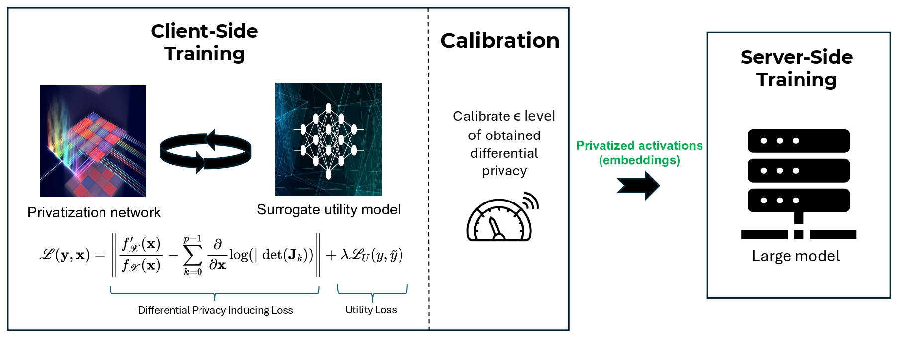

<p align="center">
  
</p>
# Power-Learning: Differentially Private and Model Agnostic Tabular Data Embeddings

This repository contains the official implementation of "Power Learning: Differentially private and model agnostic tabular data embeddings", which introduces a novel framework for sharing neural network activations with formal differential privacy guarantees.

## Overview

Traditional collaborative learning approaches focus on sharing model weights between clients and servers. Power-Learning introduces a new paradigm that enables:

- Privacy-preserving embedding generation from tabular data
- Model-agnostic server processing (compatible with neural networks, random forests, XGBoost)
- Formal differential privacy guarantees
- Efficient single-round communication
- Reduced client-side computation

## Repository Structure

```
├── Adult_income/        # Adult Income dataset experiments
├── Churn/              # Churn dataset experiments  
├── Forrest_Cover_Type/ # Forest Cover Type dataset experiments
├── Higgs/             # Higgs dataset experiments
├── LLM/               # Language model components
├── Rossman/           # Rossman dataset experiments
├── _pycache_/         # Python cache files
└── .gitignore         # Git ignore file
```

## Requirements

- Python 3.x
- PyTorch
- NVIDIA GPU with CUDA support
- Additional requirements listed in `requirements.txt` (to be added)

## Key Components

1. **Client-Side Processing**:
   - Privacy-inducing training
   - Privacy level calibration
   - Lightweight model architecture

2. **Server-Side Processing**:
   - Flexible model choice (Neural Networks, Random Forests, XGBoost)
   - High computational capacity utilization
   - Model-agnostic processing

## Datasets

The implementation has been tested on three main datasets:

1. **Forest Cover Type**
   - 580k samples
   - 54 features
   - 7 classes

2. **Higgs Boson**
   - 240k samples
   - 30 features
   - 2 classes

3. **Adult Income**
   - 48k samples
   - 14 features
   - 2 classes

## Usage

(To be added: Instructions for running the code, including example commands and parameter settings)

## Results

Our method demonstrates:
- Better privacy-utility trade-offs compared to DP-Adam
- Significant computational efficiency improvements
- Robust defense against feature space hijacking attacks
- Only 0.36% information leakage compared to 4.5% in baseline methods

## Citation

If you find this work useful in your research, please consider citing:

```bibtex
(Citation to be added after publication)
```

## License

This project is licensed under [LICENSE_NAME] - see the LICENSE file for details.

## Hardware & Code

The experiments were conducted using:
- NVIDIA A100-SXM4-80GB GPU
- Python implementation with PyTorch

## Contributing

We welcome contributions to this repository. Please feel free to submit pull requests or create issues for bugs and feature requests.

## Contact

For questions and feedback, please create an issue in the repository.

## Acknowledgments

(To be added: Any acknowledgments to contributors, funding sources, etc.)
